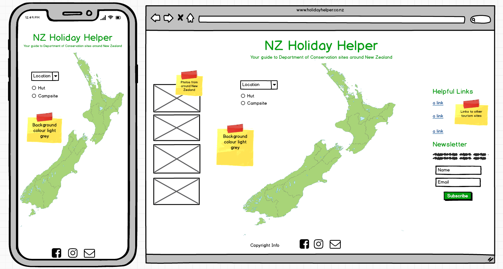

# Second Milestone Project by Holly Horwood

[NZ Holiday Helper Website](https://holly-horwood.github.io/second-milestone-project/)

---

## **Disclaimer:** 
This website was designed for educational purposes only for the Code Institute.  All best endeavours have been made to ensure all content has been obtained legally and all good practice guide lines for web development have been followed.

---

## **Motivation/Purpose**
This is my second milestone project for the Full Stack Software Development course through Code Institute.  The decision to create this site came from a passion for exploring New Zealand's wilderness with family and friends.  I wanted to put together a simple site that gave the user fast access to key camping information like huts and campsites around the country.  I wanted to display each site on a simple easy to follow map so that locations could be identified quickly and the end user could narrow down their search in the shortest amount of time.

---

## **UX** 

### **_Strategy_**

**Research:**

 I spoke with travellers staying at three local camping grounds to ask what they thought would be most helpful in an app to assist them with their travel plans.  I also spoke to friends and family as well as hunters that use DOC (Department of Conservation) land regularly.  The overall consensus was that a simple responsive map was all that was needed so that users could quickly locate places to stay as well as some key information about each site.  It was important that it could be used on a mobile phone especially for travellers as they were often on the road already when looking for the next place to stay.

**Audience:** 

 This site was designed for travellers and the general public looking places to stay within the DOC areas or New Zealand wilderness.

### **_Scope_**

**Features:**

On a mobile phone or tablet sized device the site simply displays the site title map and search options.  The user only needs to select the parameters for their search and the map will zoom to that location to show them what is available in that area.  Once that map has loaded, markers can be clicked on to show an info window with more details about the site as well as a link to the DOC website for that particular site.

On larger devices there are additional left and right side bars.  The left side bar shows photos from around New Zealand for user inspiration and on the right there are some links to helpful related websites and newsletter sign up form. 

### **_Structure_**

**Navigation:**

It is essential that the site is easy to navigate on different sized devices and that it is obvious how to use it. This was designed mobile first and is a single page static site for easy navigation, any external links can be clicked on and will open on a separate page so the user still has the original page open to easily return to. 

The map uses both a dropdown and radio buttons.  The user can select which Island they would like to search from the drop down, once they select either campsite or hut from the radio buttons the page will them automatically zoom to their selected location, switch to terrain view and populate with markers.  If there are a lot of matching sites in a particular area the markers will cluster, the user can then click on the cluster to zoom in more.  When the user has found a site they are interested in they can click on the marker to view more information about the site in a pop up info window.  The info window also offers a link to the DOC website with more information about that particular site.  The site also uses a loader/spinner to indicate to the user when the page is loading.

### **_Skeleton_**

**Wireframes:**

### **_Surface_**

I designed this site using modern neutral colours.  Different variations of green are used throughout the site to represent the element of nature.  I chose grey and white for the map so as not to detract from the marker colours.  The site is very simplistic making it easier for the user to identify key areas quickly so they can use the site effectively.  The map does offer some extra features like the ability to switch from terrain view to satelite so that the user can see more detail on the map.  On the larger view there are more images and links to help and inspire the user.

---

## **User Story**

As a user on the website I want the ability to find accommodation at DOC sites around New Zealand quickly and easily. 

**End user goal:** Find a place to stay 

**End business goal:** Make finding accommodation easier.

**Acceptance criteria:** Available to anyone travelling or holidaying in New Zealand.

---

## **Technologies Used**

**HTML & HTML5**
- HyperText Markup Language was used to create the structure        and layout of the index.html document. 
  
**CSS & CSS3**
- Used to add style to the web page.
  
**Bootstrap**
- Bootstrap was mainly used for positioning with its grid system to position containers. It was also used to create buttons, dropdowns, navbar and cards.

**Javascript**
- Was used to connect with the APIs and to manipulate them.  It was also used to create some interactive aspects of the newsletter form.

**DOC API**
- Used to retrieve data on Department of Conservation campsites and huts throughout New Zealand.

**Google Maps API**
- Google maps was used to display the map of New Zealand and create markers and marker clusters.

**Font Awesome**
- Used for icons on the page such as the footer links and search icon.

### **Other resources:**

**Stack Exchange**
- Geo.js was found here coutesy of gatadeoro and converted from Python code to Javascript for use in this project. https://gis.stackexchange.com/questions/225065/converting-nztm-new-zealand-transverse-mercator-to-lat-long

**Stack Overflow**
- Used as a resource when needing help or guidance, mostly with Javascript.

**W3C Markup & CSS Valiadators**
- Used to check validity of HTML and CSS code used in this project.

**JSHint**
- Used to check all JS code for errors.

**Ajax Loader**
- Used to create the map loader icon.
   
**GIMP** 
- Used to alter images and icons

**MDN** 
- Main resource for research and help.

---

## **Testing**

**Running the Code**

- Click on the following link to access the live site at Github pages https://holly-horwood.github.io/second-milestone-project/

All tests were carried out manually by human beings.  Firstly all buttons and links were checked to make sure they functioned as expected.  This was done in several different browsers so that any browser related issues could be fixed, the browser results are as follows:

**Chrome**

Passed.  No issues were found when used on Chrome.

**Opera**

Passed. No issues were found when used on Opera.

**Firefox**

Passed. No issues were found when used on Firefox.

**Edge**

Passed. No issues were found when used on Edge.

#### **External Testing**

**W3C Markup & CSS Valiadators**
- Used to check validity of HTML and CSS code used in this project, both returned no errors at completion.

**JSHint**
- Used to check all JS code for errors, none present on completion of this project.

#### **Issues:**

- DOC API key returned CORS error.  Contacted developer of API who worked on resolving the issue, once it was fixed from their end they contacted me and I was able to connect without anymore errors.

- Loader/Spinner not loading on all searches correctly.  This will be fixed in a future update.

- Due to Google Maps using a mercator style map it was quite difficult to get the zoom to work correctly for New Zealand. New Zealand is harder to scale than other countries due to it's very Southern location on the map which means that the latitude and longitude axels are distorted.

---

## **Future Updates**

-   In the future I would like to fix the loader to make sure it is spinning on each search page load.

- I would also like to change the marker colours so they stand out more.

- Search box placement on smaller devices.  Some zoom levels proved difficult to not have part of the island covered by the search box so may look to implement a search box that resizes for smaller devices in the future.

---

## **Deployment**

Initially this project was started in Cloud9 but after Cloud9 switched to AWS the decision was made to finish the project in VSCode due to issue using AWS.

All coding was committed and pushed to my Github repositiory at:

https://github.com/Holly-Horwood/second-milestone-project

It was also published on Github pages at:

https://holly-horwood.github.io/second-milestone-project/

### **Running The Code:**

- Go to my repository https://github.com/Holly-Horwood/second-milestone-project
- Click on the clone or download button
- In the Clone with HTTPs section, click  to copy the clone URL for my repository.
- Open Git Bash
- Type `git clone`, and then paste my URL that you copied.
- Press enter and the clone will be created.

---

## **Credits**

**Content:**

All content written by Holly Horwood.

**Media:**

- DOC Location Map Api - Crown Copyright: Department of Conservation Te Papa Atawhai [2019].
- kea.jpg & cathedralcove.jpg both obtained from Flickers Creative Commons website.
- All other images supplied by Holly Horwood and Ryan Connor from our personal collection.
- Tent and Hut icons by icons8.com
- Favicon was generated using favicon.io
- gatadeoro for his post on Stack Exchange that helped with the geo.js file creation https://gis.stackexchange.com/questions/225065/converting-nztm-new-zealand-transverse-mercator-to-lat-long
- Google Maps Marker Clusterer care of the team at google maps https://github.com/googlemaps/v3-utility-library/tree/master/markerclusterer

**Acknowledgements:**

Thanks to Sebastian Immel my mentor for all of his help and patience.  Thanks also to the students and staff at Code Institute especially my tutors Nakita, Haley and Dick.

A special thanks to Kimberly Zito, I couldn't have done this without your guidence and support.

